<!-- ╔═══════════════════════════════════════════════════════════════════════╗ -->
<!-- ║  PROFIL DE  KOSSIVI HYACINTHE AGBEDJINOU  ·  @18hyacinthe             ║ -->
<!-- ║  Portrait ASCII + Heatmap : SVG auto-générés (voir .github/workflows) ║ -->
<!-- ╚═══════════════════════════════════════════════════════════════════════╝ -->

<!-- ░░░░░░░░░░░░░░░░░░░░░░░░░  BANNIÈRE  ░░░░░░░░░░░░░░░░░░░░░░░░░ -->
<div align="center">
  
</div>

<!-- ░░░░░░░░░░░░░░░░░░░░░  TITRE ANIMÉ (TYPING)  ░░░░░░░░░░░░░░░░░░░░░ -->
<div align="center">

[](https://git.io/typing-svg)

</div>

<!-- ░░░░░░░░░░░░░░░░░░░░  PORTRAIT ASCII (SVG)  ░░░░░░░░░░░░░░░░░░░░ -->
<div align="center">
  
</div>

<!-- ░░░░░░░░░░░░░░░░░░░░░░░░░  BADGES  ░░░░░░░░░░░░░░░░░░░░░░░░░ -->
<div align="center">

  
  
  
  

</div>

---

<!-- ░░░░░░░░░░░░░░░░░░░░░░░░  WHOAMI  ░░░░░░░░░░░░░░░░░░░░░░░░ -->
## `~/whoami`

```bash
$ ./identity.sh --verbose

  ┌─[ IDENTITÉ ]───────────────────────────────────────────────┐
  │ Nom          : Kossivi Hyacinthe AGBEDJINOU                 │
  │ Rôle         : Software Engineer · Full-Stack & Mobile      │
  │ Formation    : Bachelor Ingénierie — École Centrale        │
  │                Casablanca (Informatique & Systèmes, 3e an)  │
  │ Spécialités  : Web sécurisé · Mobile · DevOps · IA · Web3   │
  │ Certifié     : Meta FE/BE · Google Cybersecurity & Agile    │
  │ Mindset      : analytique · leadership · innovation         │
  └────────────────────────────────────────────────────────────┘

$ cat mission.txt
> Concevoir des applications web & mobiles sécurisées, évolutives
> et élégantes — puis les livrer en production, proprement.
```

---

<!-- ░░░░░░░░░░░░░░░░░░░░░░░  ARSENAL / STACK  ░░░░░░░░░░░░░░░░░░░░░░░ -->
## `~/arsenal` — Stack technique

<table align="center">
<tr>
<td align="center" width="33%">

**Langages**


</td>
<td align="center" width="33%">

**Web & Mobile**


</td>
<td align="center" width="33%">

**Cloud & DevOps**


</td>
</tr>
<tr>
<td align="center">

**Bases de données**


</td>
<td align="center">

**IA / ML**


</td>
<td align="center">

**Outils**


</td>
</tr>
</table>

---

<!-- ░░░░░░░░░░░░░░░  CONTRIBUTIONS TEMPS RÉEL (HEATMAP SVG)  ░░░░░░░░░░░░░░░ -->
## `~/activity` — Contributions en temps réel

<div align="center">
  
</div>

<br/>

<!-- Cartes de stats, thème sombre cohérent -->
<div align="center">
  
  
</div>

<div align="center">
  
</div>

<!-- Serpent qui dévore les contributions (généré par GitHub Actions) -->
<div align="center">
  
</div>

---

<!-- ░░░░░░░░░░░░░░░░░░░░░░░  PROJETS ÉPINGLÉS  ░░░░░░░░░░░░░░░░░░░░░░░ -->
## `~/projects` — Sélection

<table align="center">
<tr>
<td width="50%" valign="top">

### 📦 BagX
Gestion de livraison intelligente : suivi temps réel, notifications push, UI moderne.

`React Native` · `PostgreSQL` · `Cloudinary` · `FCM`

</td>
<td width="50%" valign="top">

### 🍽️ TengaMarket
Marketplace B2B pour restaurants avec paiement Mobile Money.

`Flutter` · `Laravel` · `PostgreSQL` · `FCM`

</td>
</tr>
<tr>
<td width="50%" valign="top">

### 🎓 SmartCampus
Plateforme SaaS modulaire de gestion universitaire.

`Next.js` · `Express` · `PostgreSQL`

</td>
<td width="50%" valign="top">

### 🔒 ePayslip
Digitalisation sécurisée des fiches de paie (chiffrement documents).

`Laravel` · `PrivateDocs Encryption`

</td>
</tr>
</table>

---

<!-- ░░░░░░░░░░░░░░░░░░░░░░░░  CERTIFICATIONS  ░░░░░░░░░░░░░░░░░░░░░░░░ -->
## `~/certifications`

<div align="center">


</div>

---

<!-- ░░░░░░░░░░░░░░░░░░░░░░░░░  CONNECT  ░░░░░░░░░░░░░░░░░░░░░░░░░ -->
## `~/connect`

<div align="center">

  <a href="https://empereur-dev.tech"></a>
  <a href="https://linkedin.com/in/KossiviHyacintheAGBEDJINOU"></a>
  <a href="mailto:kagbedjinou@yahoo.com"></a>
  <a href="https://github.com/18hyacinthe"></a>
  <a href="https://x.com/DonBrozy"></a>

</div>

<div align="center">
  
  <sub><code>EOF — stay curious, ship secure. 🐋</code></sub>
</div>
